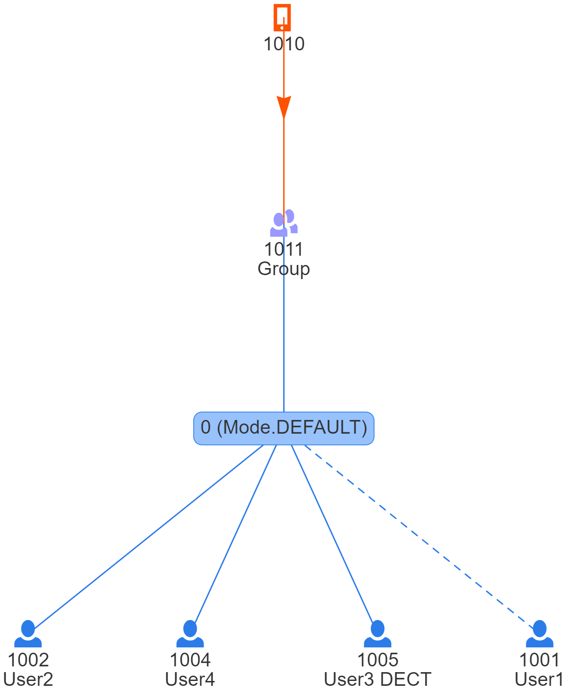
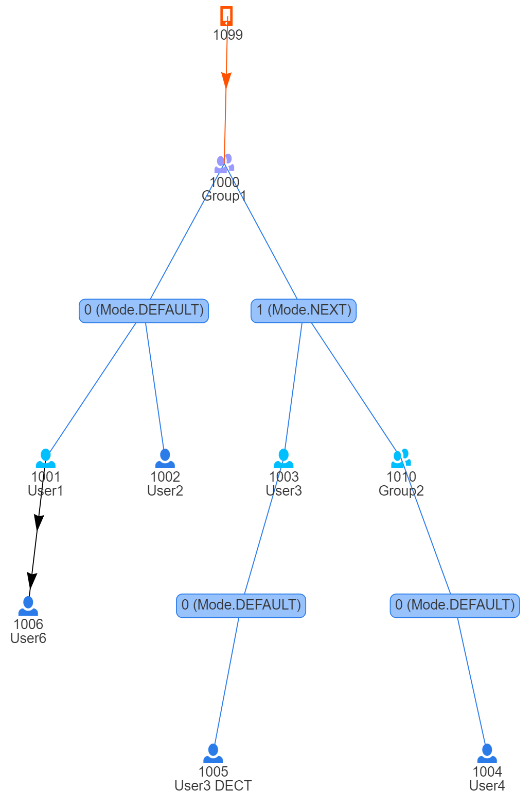

# Yate Wählsystem Digital

Ywsd is a telephone number routing engine for the [Yate](http://Yate.ro/) telephone engine to be used in event
telephone networks. It provides the routing backend for common PBX features such as group calls (including delayed
ringing and hunting groups), (conditional) call forwarding, caller verification or caller masquerading. The main design
goal of this backend to provide as much flexibility for call routing as possible while ensuring a certain set of
consistency conditions. To split the phone network into multiple failure domains or also allow for load
balancing, Ywsd is designed to support a PBX that consists of multiple Yate servers. Routing information is (globally)
stored in a PostgreSQL database that enforces consistency of basic participant properties and the links between
extensions (groups, forwards, etc…).

Based on this consistent data model, the routing offers all kinds of degrees of freedom. There is no principle
limitation on nesting call groups or mixing groups with call forwards as needed. Extensions that are external to the
PBX can be added with a placeholder extension entry and also participate in groups and forwards. Still, the engine will
ensure that created calls do not create call loops and phones cannot be called from the same call more than once.

If you don't want to know the details, just [jump to the setup guide](#Getting-started)

## Basic Architecture

Ywsd based routing is split into two stages. Routing stage 1 calculates all extensions that are involved in a call
as well as their relation (groups, forwards, delays, etc…). It does not resolve the call to SIP addresses of the
individual participant but only goes so far as to know on which SIP server the participant should be registered and
will route calls to this SIP server.

Routing 2 then takes care of the information which devices registered for a SIP extension. It supports multiple
device registrations per extensions and configurable call waiting support per extension.

## Stage1 Architecture

Routing is illustrated as a tree in ywsd. An extension is a leaf in such a tree if it can be immediately routed.
That is, it corresponds to a physical extension, has no forwards or other devices that should ring when a call
is routed to it. Otherwise, an extension is an inner node. This is most visible for call groups. They have all
call group members as children in the routing tree and don't correspond to a device themselves. The routing, however,
also supports a mixed-mode (called multi-ring) where an extension has a physical device and behaves like a call group at
the same time. This is used to, e.g., configure desktop SIP phone to also ring when your DECT is ringing.

Extensions can also become inner tree nodes if they forward to another extension. This can also lead to a situation
where this extension won't be called anymore (immediate forward) or will be called for a while and only then the
forward will be activated (delayed forward). The routing engine also supports forward on busy or forward on unavailable.

One might think that routing can and should rather be represented as DAG than as tree. In particular, if two nested
groups have the same member, shouldn't those be merged?. Unfortunately, call routing has unpredictable timing
behaviour. Depending on hunt group or delayed ring configuration it is not possible to consider all scenarios statically
while routing as the final behaviour can depend on which devices are currently active and/or busy. Thus, ywsd keeps the
tree representation and has additional measures to ensure devices don't ring twice on the same call at runtime.

### Tree Discovery

The final routing result is computed in two big steps. The first step called **tree discovery** retrieves the routing
tree node by node from the database. While walking along the tree, it ensures that no loops are created and disables
branches that would lead to a loop. It also decides in which direction the tree is expanded. For example, the members
of a group that have an active immediate forward are not loaded.

#### Groups and call forks 

The implementation of call groups follows closely Yate's CallFork module. A fork may have multiple ranks. Each rank
represents a set of extensions that is called at the same time. The ranks are ordered. Each rank can either extend
the current call of the previous rank after a given time or replace all participants called in the previous rank(s).

Consequently, inner tree nodes can link immediately to another extension (with forwards) or a fork rank that
(itself) then links to extensions. The following examples illustrate the shape of call routing trees.



This shows a simple routing tree in which the extension 1010 calls the group 1011. This group has four participants.
These are the extensions 1002, 1004, 1005 and 1001. The user with extension 1001 has currently paused their membership
and was thus discovered but will not be considered in the generated call.



This is a more involved example of a routing tree that features groups with multiple and non-default fork ranks,
nested groups and a call forward from user 1001 to 1006. It illustrates no particular use case but should rather
serve as an example of how generic and complex routing trees might look like.

### Route Generation

The second routing step is called **route generation**. It uses a Visitor pattern to walk along the previously
calculated routing tree and generates an intermediate routing result for each inner node based on the intermediate
routing results of its children. So, the route generation process is bottom-up. The basic idea is that every inner node
of the routing tree will lead to a Yate call fork. The fork will contain all children of the respective tree node.

If the child can be routed immediately, this is then a reference to the sip module with a reference to which SIP server
to call. If the target is locally on the same Yate, it will just issue a `lateroute/` for the extension with a flag to
forward this to routing stage 2.

If the child is again an inner node, the call target is symbolic and of the form `lateroute/stage1-<callid>-<treepath>`.
To ensure consistency in the routing, all intermediate routing results will be cached after the initial routing
was completely calculated. Once the call progresses, Yate's lateroute module will query the routing engine again for the
symbolic names of the inner nodes. These requests will then be answered from the cache.

Altogether, this approach gives maximum flexibility and also allows for constructs that a single call fork would not
be able to provide. E.g., a single call fork is unable to provide forward on busy for one participant while
implementing delayed ringing for another. This is only possible by letting the forks follow the structure of the routing
tree.

## Stage2 Architecture

Stage 2 routing is relatively simple and dumb (compared to Stage 1). It is based on a simple user and registration
table in the database. In addition to this, Yate's register module is used to maintain a list of currently registered
SIP devices per extension in the registration table.

Stage 2 routing is either triggered by the flag *eventphone_stage2* in the `call.route` message (put there by
routing stage 1) or automatically triggered if a call is coming from a specific SIP listener. In our multi Yate PBX
setup, we use one network with special SIP listeners that exchanges all calls between the different Yate instances
of our PBX. Such calls from another Yate in our PBX where stage1-routed on their home Yate.
They only need stage 2 at this point.

The main job of stage 2 routing is to forward the call to the actual SIP extension. If there is only a single
registration, the sip module will be immediately called with the registered SIP endpoint. If there are multiple
devices registered, one last simple and flat call fork with all the registered SIP endpoints will be issued.

In addition to this, stage2 uses the cdrbuild module to keep track of calls that are currently active at an extension.
It tracks the number of calls currently active on a device as well as the callids (uuid4). Call id tracking is used to
ensure that a single call does not lead to a device ringing twice on the same call. The duplicate call is filtered here.
The number of active calls is used to signal busy if call waiting is deactivated for the extension. If call waiting is
active, the extension will be called independent of whether the line is currently busy or not.

So please note that stage2 needs a particular configuration of the `cdrbuild` and `register` module in Yate to
work correctly. See instructions below.

## Getting started

Ywsd uses a PostgeSQL database backend that is accessed via the asyncio aiopg module. As a consequence, a minimal test
setup needs a Postgres database and all python packages from requirements.txt installed. For production deployments,
cached routing results should be stored in a Redis instance. For development purposes, the simple python built-in
dictionary-based cache suffices.

Next, a `routing_engine.yaml` configuration file needs to be created. You can see the example file that ships with this
repository to get a feeling of how it could look like.

Once the configuration is complete, the database can be setup. Run `ywsd_init_db --config <your_config> --stage1` to
bootstrap the stage1 routing database. Then run `ywsd_init_db --config <your_config> --stage2` to bootstrap the stage2
routing database.

In principle, your ywsd instance is now ready to go. To actually route something, for sure, the database
needs to be populated with extensions.

If you want to test ywsd without a running Yate, you may use the webserver only mode. Start ywsd with
```
ywsd_engine --config <your_config> --web-only
```
Ywsd then starts without connecting to a Yate and just offers the webserver on the configured interface/port. You can
then ask for a sample routing and will get the results in JSON form. Depending on your test data, results can look
like this:
```
curl http://localhost:9000/stage1\?caller\=2001\&called\=4711 | jq .
  % Total    % Received % Xferd  Average Speed   Time    Time     Time  Current
                                 Dload  Upload   Total   Spent    Left  Speed
100   172  100   172    0     0  24571      0 --:--:-- --:--:-- --:--:-- 24571
{
  "routing_tree": null,
  "main_routing_result": null,
  "all_routing_results": {},
  "routing_status": "ERROR",
  "routing_status_details": "noroute: Routing target was not found"

curl http://localhost:9000/stage1\?caller\=2001\&called\=2000 | jq .
  % Total    % Received % Xferd  Average Speed   Time    Time     Time  Current
                                 Dload  Upload   Total   Spent    Left  Speed
100  3550  100  3550    0     0   247k      0 --:--:-- --:--:-- --:--:--  247k
{
  "routing_tree": {
    "id": 1,
    "yate_id": null,
    "extension": "2000",
    "name": "PoC",
    "short_name": null,
    "outgoing_extension": null,
    "outgoing_name": null,
    "dialout_allowed": false,
    "ringback": null,
    "forwarding_delay": null,
    "forwarding_extension_id": null,
    "lang": "de_DE",
    "type": "Type.GROUP",
    "forwarding_mode": "ForwardingMode.DISABLED",
    "tree_identifier": "1",
    "logs": [],
    "fork_ranks": [
      {
        "id": 1,
        "extension_id": 1,
        "index": 0,
        "delay": null,
        "mode": "Mode.DEFAULT",
        "tree_identifier": "1-fr1",
        "logs": [
          {
            "msg": "Discovery aborted for <Extension 2001, name=PoC Sascha, type=Type.MULTIRING> in <ForkRank id=1, extension_id=1, index=Mode.DEFAULT, mode=0, delay=Mode.DEFAULT>, was already present.\nTemporarily disable membership for this routing.",
            "level": "WARN",
            "related_node": "1-fr1-2"
          }
        ],
        "members": [
          {
            "type": "RankMemberType.DEFAULT",
            "active": false,
            "extension": {
              "id": 2,
              "yate_id": 2,
              "extension": "2001",
              "name": "PoC Sascha",
              "short_name": null,
              "outgoing_extension": null,
              "outgoing_name": null,
              "dialout_allowed": false,
              "ringback": null,
              "forwarding_delay": null,
              "forwarding_extension_id": null,
              "lang": "de_DE",
              "type": "Type.MULTIRING",
              "forwarding_mode": "ForwardingMode.DISABLED",
              "tree_identifier": "1-fr1-2",
              "logs": []
            }
          },
          {
            "type": "RankMemberType.DEFAULT",
            "active": true,
            "extension": {
              "id": 3,
              "yate_id": 2,
              "extension": "2002",
              "name": "PoC Bernie",
              "short_name": null,
              "outgoing_extension": null,
              "outgoing_name": null,
              "dialout_allowed": false,
              "ringback": null,
              "forwarding_delay": null,
              "forwarding_extension_id": null,
              "lang": "de_DE",
              "type": "Type.SIMPLE",
              "forwarding_mode": "ForwardingMode.DISABLED",
              "tree_identifier": "1-fr1-3",
              "logs": []
            }
          },
          {
            "type": "RankMemberType.DEFAULT",
            "active": true,
            "extension": {
              "id": 4,
              "yate_id": 2,
              "extension": "2004",
              "name": "PoC BeF",
              "short_name": null,
              "outgoing_extension": null,
              "outgoing_name": null,
              "dialout_allowed": false,
              "ringback": null,
              "forwarding_delay": null,
              "forwarding_extension_id": null,
              "lang": "de_DE",
              "type": "Type.SIMPLE",
              "forwarding_mode": "ForwardingMode.DISABLED",
              "tree_identifier": "1-fr1-4",
              "logs": []
            }
          },
          {
            "type": "RankMemberType.DEFAULT",
            "active": true,
            "extension": {
              "id": 6,
              "yate_id": 2,
              "extension": "2042",
              "name": "PoC Garwin",
              "short_name": null,
              "outgoing_extension": null,
              "outgoing_name": null,
              "dialout_allowed": false,
              "ringback": null,
              "forwarding_delay": null,
              "forwarding_extension_id": null,
              "lang": "de_DE",
              "type": "Type.SIMPLE",
              "forwarding_mode": "ForwardingMode.DISABLED",
              "tree_identifier": "1-fr1-6",
              "logs": []
            }
          }
        ]
      }
    ]
  },
  "main_routing_result": {
    "type": "Type.FORK",
    "target": {
      "target": "lateroute/stage1-d4490817a7954559ac801f81f3dbbd7e-1",
      "parameters": {
        "x_eventphone_id": "d4490817a7954559ac801f81f3dbbd7e",
        "osip_X-Eventphone-Id": "d4490817a7954559ac801f81f3dbbd7e",
        "callername": "PoC Sascha",
        "osip_X-Caller-Language": "de_DE",
        "calledname": "PoC"
      }
    },
    "fork_targets": [
      {
        "target": "lateroute/2002",
        "parameters": {
          "eventphone_stage2": "1",
          "x_eventphone_id": "d4490817a7954559ac801f81f3dbbd7e",
          "osip_X-Eventphone-Id": "d4490817a7954559ac801f81f3dbbd7e"
        }
      },
      {
        "target": "lateroute/2004",
        "parameters": {
          "eventphone_stage2": "1",
          "x_eventphone_id": "d4490817a7954559ac801f81f3dbbd7e",
          "osip_X-Eventphone-Id": "d4490817a7954559ac801f81f3dbbd7e"
        }
      },
      {
        "target": "lateroute/2042",
        "parameters": {
          "eventphone_stage2": "1",
          "x_eventphone_id": "d4490817a7954559ac801f81f3dbbd7e",
          "osip_X-Eventphone-Id": "d4490817a7954559ac801f81f3dbbd7e"
        }
      }
    ]
  },
  "all_routing_results": {},
  "routing_status": "OK",
  "routing_status_details": ""
}
```

## Necessary Yate configuration to make it run

The Yate modules `register` and `cdrbuild` provide partial functionality to stage2 ywsd-based routing. In particular,
the register module is used to manage registrations of SIP clients in the stage2 database. The cdrbuild module keeps
track of the calls on a certain SIP client and fills the stage2 database with information that is needed to provide
deny-on-busy or filtering if a single call ends up twice with one SIP client.

The following configuration is needed in these modules to provide the desired functionality. Please also note
that Yate needs to be compiled and configured to use Postgres database via the `pgsqldb` module.

Example register.conf:
```
[general]
expires=30

user.auth=yes
user.register=yes
user.unregister=yes
engine.timer=yes
;call.preroute=no
call.cdr=yes
linetracker=yes

[default]
priority=10
account=default

[user.auth]
query=SELECT password FROM users WHERE username='${username}' AND password IS NOT NULL AND password<>'' AND type='user' LIMIT 1;
result=password

[user.register]
query=INSERT INTO registrations (username, location, oconnection_id, expires) VALUES ('${username}', '${data}', '${oconnection_id}', NOW() + INTERVAL '${expires} s') ON CONFLICT ON CONSTRAINT uniq_registrations DO UPDATE SET expires = NOW() + INTERVAL '${expires} s'

[user.unregister]
query=DELETE FROM registrations WHERE (username = '${username}' AND location = '${data}' AND oconnection_id = '${connection_id}') OR ('${username}' = '' AND '${data}' = '' AND oconnection_id = '${connection_id}')

[engine.timer]
query=DELETE FROM registrations WHERE expires<=CURRENT_TIMESTAMP;

[call.cdr]
critical=no

[linetracker]
critical=yes
initquery=UPDATE users SET inuse=0 WHERE inuse is not NULL;DELETE from active_calls;
cdr_initialize=UPDATE users SET inuse=inuse+1 WHERE username='${external}';INSERT INTO active_calls SELECT username, x_eventphone_id FROM (SELECT '${external}' as username, '${X-Eventphone-Id}' as x_eventphone_id, '${direction}' as direction) as active_call WHERE x_eventphone_id != '' AND x_eventphone_id IS NOT NULL and direction = 'outgoing';
cdr_finalize=UPDATE users SET inuse=(CASE WHEN inuse>0 THEN inuse-1 ELSE 0 END) WHERE username='${external}';DELETE FROM active_calls WHERE username = '${external}' AND  x_eventphone_id = '${X-Eventphone-Id}' AND '${direction}' = 'outgoing';
```

To enable duplicate call filtering, the parameters section of your cdrbuild.conf should have a line for
X-Eventphone-Id like this
```
[parameters]
X-Eventphone-Id=false
```

## Project ToDos

There are currently no tests available for this project. There is a basic set of test data that was used during
development and integration with Yate but no automatic testing was developed so far. Due to the nature of this
project, it plans to add a suite of end-to-end functionality tests based on the webserver exposure of routing
results. An extensive set of unit tests for DB loading or data structure generation is currently not planned
but would be welcomed if contributed.
